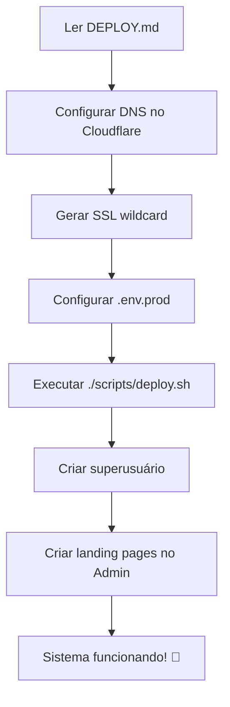

# 📂 ARQUIVOS IMPORTANTES DO PROJETO

## 📚 DOCUMENTAÇÃO (Leia nesta ordem)

### 1️⃣ Para Deploy em Produção (Portainer):
```
📄 PORTAINER_GIT_DEPLOY.md   ← RECOMENDADO! Deploy via Git (auto-update)
📄 DEPLOY.md                 ← Guia completo (método tradicional)
📄 PORTAINER_QUICKSTART.md   ← Resumo rápido (5 passos)
📄 PORTAINER_STACK.txt       ← Stack pronta para copiar/colar
📄 README.md                 ← Visão geral do projeto
📄 SECURITY_SUMMARY.md       ← Segurança do sistema (A+)
```

### 2️⃣ Para Desenvolvimento Local:
```
📄 QUICKSTART.md        ← Guia rápido (5 minutos)
📄 LANDINGS_README.md   ← Documentação técnica completa
```

### 3️⃣ Para SSL Automático (Domínios Personalizados):
```
📄 SSL_AUTOMATICO.md    ← Sistema de SSL automático (GRÁTIS!)
```

---

## 🔧 SCRIPTS

```bash
scripts/
├── deploy.sh              # Deploy completo do sistema
├── backup.sh              # Backup automático (DB + media)
├── security_check.sh      # Verificar segurança
└── setup_autoscaling.sh   # Configurar auto-scaling (OPCIONAL)
```

**Uso:**
```bash
# Deploy principal
./scripts/deploy.sh

# Backup manual
./scripts/backup.sh

# Verificar segurança
./scripts/security_check.sh

# Auto-scaling (se precisar escalar muito)
./scripts/setup_autoscaling.sh
```

---

## 🐳 DOCKER

```
docker-compose.prod.yml   # Configuração para PRODUÇÃO (use este!)
.env.prod.example         # Template de variáveis (copie para .env.prod)
docker/
├── Dockerfile.prod       # Imagem Docker otimizada
├── nginx_proxy.conf      # NGINX multi-tenant
└── gunicorn_config.py    # Configuração do Gunicorn
```

---

## ⚙️ CONFIGURAÇÃO

```
config/
├── settings.py          # Settings Django (já configurado)
├── urls.py              # URLs principais
└── celery.py            # Configuração Celery

.env.prod.example        # Template de variáveis de ambiente
pyproject.toml           # Dependências Python (UV)
```

---

## 🏗️ CÓDIGO PRINCIPAL

```
apps/landings/           # App de Landing Pages (NÚCLEO)
├── models.py            # LandingPage, Property, Theme
├── views.py             # Views públicas + dashboard
├── middleware.py        # TenantMiddleware (multi-tenant)
├── admin.py             # Admin customizado
├── theme_manager.py     # Gerenciador de temas
└── management/
    └── commands/
        └── install_themes.py  # Comando para instalar temas
```

---

## 🎨 TEMPLATES E TEMAS

```
templates/landings/
├── base_landing.html         # Base para todos os temas
├── _components/              # Componentes reutilizáveis
│   ├── property_card.html
│   └── contact_section.html
└── themes/                   # TEMAS DO SISTEMA
    ├── modern/               # ✨ Tema Moderno
    │   ├── theme.json
    │   └── index.html
    ├── classic/              # 🎩 Tema Clássico
    │   ├── theme.json
    │   └── index.html
    ├── minimal/              # 🎯 Tema Minimalista
    │   ├── theme.json
    │   └── index.html
    └── default/              # 📦 Tema Padrão (fallback)
        ├── theme.json
        └── index.html
```

**Para adicionar novo tema:**
1. Criar pasta em `templates/landings/themes/meu-tema/`
2. Adicionar `theme.json` + `index.html`
3. Rodar: `python manage.py install_themes`

---

## 📊 MONITORAMENTO (Opcional)

```
monitoring/
├── prometheus.yml         # Config Prometheus
└── prometheus-rules.yml   # Regras de alerta
```

---

## ❌ O QUE FOI REMOVIDO (Arquivos desnecessários)

Estes arquivos foram **deletados** pois eram duplicados ou confusos:
- ❌ PORTAINER_STACK.yml (duplicado)
- ❌ README_PORTAINER.md (duplicado)
- ❌ DEPLOY_PORTAINER.md (duplicado)
- ❌ AUTOSCALING.md (duplicado)
- ❌ AUTOSCALING_QUICK.md (duplicado)
- ❌ SECURITY_AUDIT.md (muito grande, use SECURITY_SUMMARY.md)
- ❌ INDEX.md (desnecessário)
- ❌ docker-compose.swarm.yml (gerado automaticamente quando necessário)

**Agora você tem APENAS o essencial! 🎯**

---

## 🚀 FLUXO DE DEPLOY



---

## 📋 CHECKLIST RÁPIDO

### Deploy em Produção:
- [ ] Ler `DEPLOY.md`
- [ ] Configurar DNS wildcard
- [ ] Gerar certificado SSL
- [ ] Copiar `.env.prod.example` → `.env.prod`
- [ ] Editar `.env.prod` (SECRET_KEY, senhas, domínio)
- [ ] Executar `./scripts/deploy.sh`
- [ ] Criar superusuário
- [ ] Acessar admin e criar landing pages
- [ ] Testar subdomínios

### Desenvolvimento Local:
- [ ] Ler `QUICKSTART.md`
- [ ] Instalar dependências: `uv sync`
- [ ] Rodar migrations: `python manage.py migrate`
- [ ] Instalar temas: `python manage.py install_themes`
- [ ] Criar superusuário
- [ ] Rodar: `python manage.py runserver`

---

## 🆘 PRECISA DE AJUDA?

### 1. Deploy não funcionou?
```bash
# Ver logs
docker-compose -f docker-compose.prod.yml logs -f

# Verificar containers
docker ps

# Verificar segurança
./scripts/security_check.sh
```

### 2. Landing page não aparece?
- Verificar se está **Publicada** e **Ativa** no Admin
- Verificar logs: `docker logs propzy-app`
- Conferir DNS no Cloudflare

### 3. Erro de SSL?
```bash
# Regenerar certificado
certbot renew --force-renewal

# Reiniciar nginx
docker restart propzy-nginx
```

### 4. Erro ao instalar temas?
```bash
# Verificar estrutura
ls -la templates/landings/themes/

# Reinstalar
docker exec propzy-app python manage.py install_themes
```

---

## ✅ RESUMO

### O que você TEM:
- ✅ Sistema multi-tenant completo
- ✅ 4 temas profissionais
- ✅ SSL automático
- ✅ Backup automático
- ✅ Segurança A+
- ✅ Documentação clara e objetiva
- ✅ Scripts de automação

### O que você PRECISA fazer:
1. **Ler DEPLOY.md** (30-60 min)
2. **Executar `./scripts/deploy.sh`** (5 min)
3. **Criar landing pages no Admin** (5 min por landing)
4. **Pronto! Sistema funcionando! 🎉**

### O que o sistema faz SOZINHO:
- ✅ Rotear subdomínios automaticamente
- ✅ Renovar SSL automaticamente
- ✅ Fazer backup diário
- ✅ Escalar se necessário (com auto-scaling)
- ✅ Se proteger contra ataques
- ✅ Atualizar containers (Watchtower)

---

**🎯 FOCO:** Leia `DEPLOY.md` e siga o passo a passo!
**⏱️ TEMPO:** 30-60 minutos do zero ao ar!
**💰 CUSTO:** ~$40-60/mês (servidor básico)

**BOA SORTE! 🚀**

